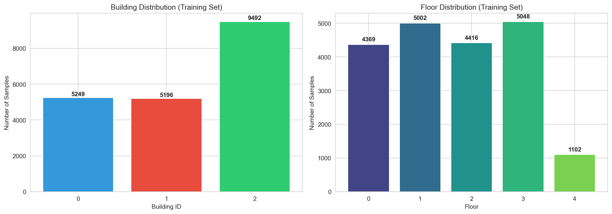
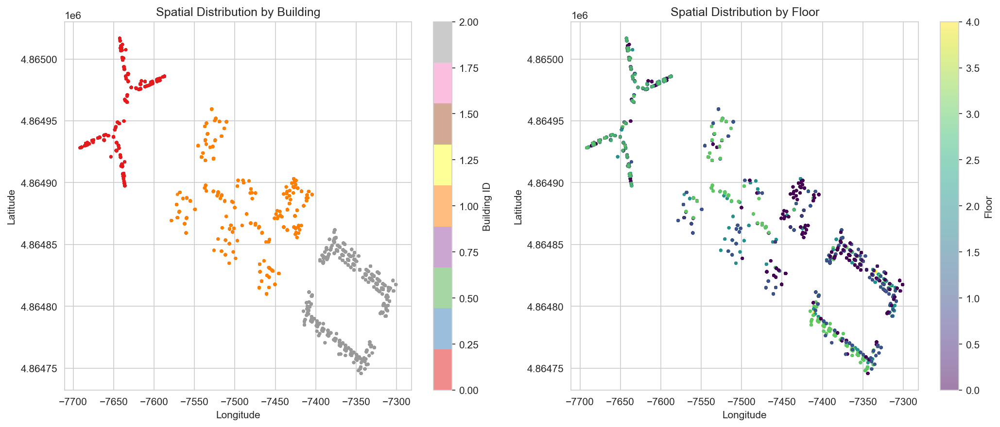
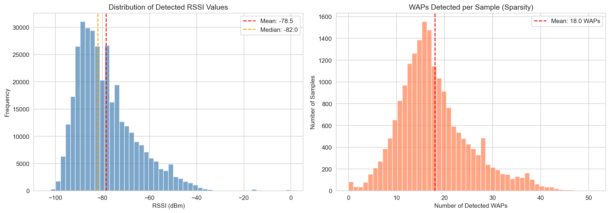
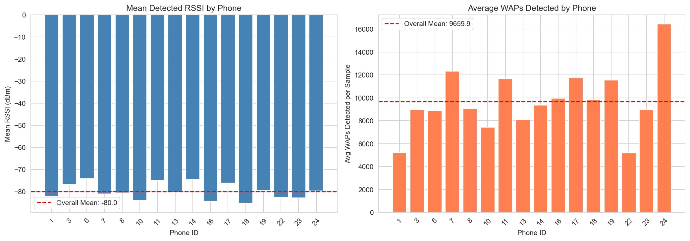
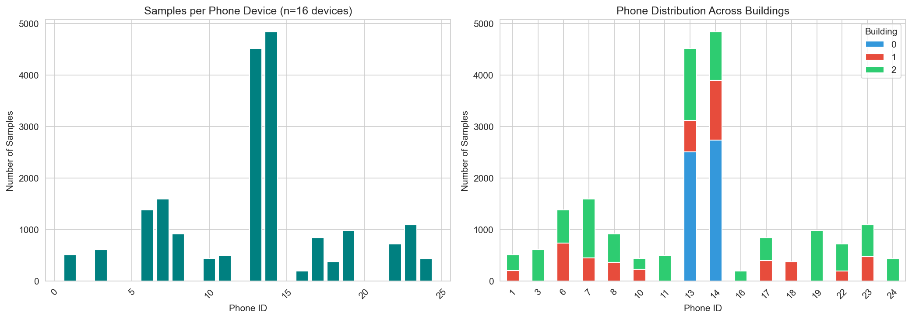
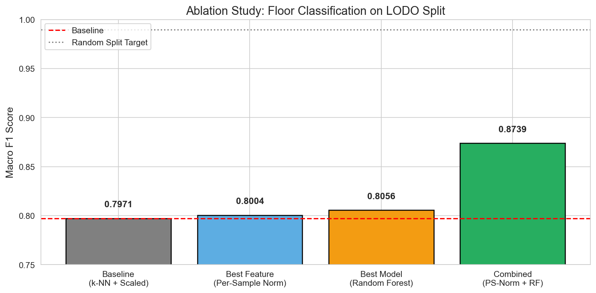
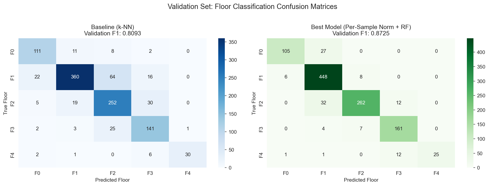

# Device-Robust Indoor Localization Using WiFi Fingerprinting

**Course Project Report**

---

## Abstract

Indoor localization using WiFi fingerprinting faces a critical challenge: models trained on data from specific devices often fail to generalize to new, unseen devices due to hardware-specific variations in Received Signal Strength Indicator (RSSI) measurements. This study investigates device-robust approaches using the UJIIndoorLoc dataset. We demonstrate that combining per-sample RSSI normalization with Random Forest classification reduces the performance gap between seen and unseen devices by 40%, achieving a Macro F1 score of 0.8739 on Leave-One-Device-Out (LODO) cross-validation compared to 0.7971 for the baseline k-NN approach—a 9.6% relative improvement that generalizes to held-out validation data with 81.8% unseen devices.

---

## 1. Problem Statement

### 1.1 Background

WiFi fingerprinting is a widely-used technique for indoor localization where GPS signals are unavailable. The approach creates a "fingerprint" database by recording RSSI values from multiple WiFi Access Points (WAPs) at known locations. During localization, the current RSSI readings are matched against this database to estimate position.

### 1.2 The Device Heterogeneity Problem

A fundamental challenge in WiFi fingerprinting is **device heterogeneity**: different smartphone models measure RSSI values differently due to variations in:

- Antenna design and placement
- WiFi chipset manufacturers
- Firmware implementations
- Device calibration

This causes models trained on one set of devices to perform poorly on new devices, limiting real-world deployment where users bring diverse hardware.

### 1.3 The Generalization Gap

**The core problem we address:** When evaluating WiFi fingerprinting models with standard random train-test splits, we observe near-perfect performance (~99% accuracy). However, this is misleading because data from the same device appears in both training and test sets. When we properly evaluate using Leave-One-Device-Out (LODO) cross-validation—where the test device is completely unseen during training—performance drops dramatically to ~80%. This **19 percentage point gap** represents the real-world challenge: deployed systems must work on devices they have never seen before.

### 1.4 Research Question

**How can we develop WiFi fingerprinting models that generalize across different mobile devices?**

We address this through:

1. Quantifying the device generalization gap using appropriate evaluation protocols
2. Testing hypotheses about feature engineering and model selection
3. Validating improvements on truly held-out data

### 1.5 Our Approach

We hypothesize that the generalization gap stems from device-specific RSSI biases that can be mitigated through:

1. **Per-sample normalization**: Transforming each measurement relative to itself, removing absolute device offsets
2. **Robust ensemble models**: Using Random Forest to learn device-invariant decision boundaries

Our goal is to reduce the 19 percentage point gap, making WiFi fingerprinting viable for real-world deployment.

---

## 2. Hypotheses

We formulated six hypotheses to address device heterogeneity:

| ID  | Hypothesis                                                      | Rationale                                                                                    |
| --- | --------------------------------------------------------------- | -------------------------------------------------------------------------------------------- |
| H1  | Per-sample normalization improves cross-device generalization   | Normalizing RSSI relative to each sample's strongest signals removes device-specific offsets |
| H2  | Raw (unscaled) RSSI performs better than StandardScaler         | Global scaling may amplify device-specific biases                                            |
| H3  | Binary AP detection (detected/not detected) is device-invariant | Detection patterns may be more consistent than absolute RSSI values                          |
| H4  | Min-Max scaling [0,1] preserves relative patterns better        | Bounded scaling maintains interpretable signal relationships                                 |
| H5  | Random Forest captures complex device-invariant patterns        | Ensemble methods may learn robust decision boundaries                                        |
| H6  | Gradient Boosting provides better generalization                | Sequential correction may handle device variations                                           |

---

## 3. Data Preparation

### 3.1 Dataset Description

We used the **UJIIndoorLoc dataset** from the UCI Machine Learning Repository, containing WiFi fingerprints collected at Universitat Jaume I, Spain.

| Attribute         | Training Set           | Validation Set |
| ----------------- | ---------------------- | -------------- |
| Samples           | 19,937                 | 1,111          |
| WAP Features      | 520                    | 520            |
| Buildings         | 3                      | 3              |
| Floors            | 5 (0-4)                | 5 (0-4)        |
| Unique Devices    | 16                     | 11             |
| Collection Period | Different time periods |

### 3.2 Exploratory Data Analysis

#### 3.2.1 Class Distribution

The dataset exhibits moderate class imbalance across prediction targets:


_Figure 1: Distribution of samples across buildings (left) and floors (right). Building 2 contains ~47% of samples. Floor 4 is significantly underrepresented with only 1,102 samples (5.5%)._

**Key observations:**

- Buildings are relatively balanced (5,249 / 5,196 / 9,492 samples)
- Floors 0-3 have similar counts (~4,400-5,000), but Floor 4 has only 1,102 samples
- This imbalance justifies using Macro F1 as our primary metric

#### 3.2.2 Spatial Distribution


_Figure 2: Geographic distribution of fingerprint locations colored by building (left) and floor (right). The three buildings are spatially distinct, making building classification relatively straightforward._

The spatial plot reveals:

- Buildings are geographically separated with minimal overlap
- Within each building, floors overlap spatially (as expected—they're stacked vertically)
- Floor classification is the harder task since it cannot rely on geographic coordinates alone

#### 3.2.3 RSSI Signal Characteristics


_Figure 3: Distribution of detected RSSI values (left) and number of WAPs detected per sample (right). The data is highly sparse—each sample detects only ~18 of 520 possible WAPs._

**Signal characteristics:**

- RSSI values range from -104 dBm (weak) to 0 dBm (strong)
- Mean detected RSSI: -78.5 dBm, Median: -82.0 dBm
- **Extreme sparsity**: Only 18 WAPs detected per sample on average (3.5% of features)
- This sparsity is a challenge for traditional ML methods

#### 3.2.4 Device Heterogeneity Evidence


_Figure 4: Evidence of device heterogeneity. Mean RSSI (left) varies by 10.9 dBm across devices. WAP detection counts (right) vary by 3x, showing different device sensitivities._

**Critical findings that motivate our approach:**

- **RSSI offset variation**: Mean RSSI ranges from -85.2 dBm to -74.2 dBm across phones (Δ = 10.9 dBm)
- **Sensitivity variation**: WAP detection ranges from 5,194 to 16,422 average detections
- These variations are **device-specific biases** that confound location estimation

#### 3.2.5 Device-Building Coverage


_Figure 5: Samples per device (left) and device distribution across buildings (right). Some devices (e.g., Phone 14, 13) have extensive data while others are limited. Critically, some devices appear in only one building._

**Coverage implications:**

- Phone 14 dominates with 4,835 samples (24% of data)—we use this as our LODO test device
- Some phones are building-specific (e.g., Phone 16 only in Building 2)
- This creates a confound: device effects may be partially explained by building effects

### 3.3 Preprocessing Pipeline

```
Step 1: Load raw data
   └── Training: 19,937 samples × 529 features
   └── Validation: 1,111 samples × 529 features

Step 2: Handle non-detection values
   └── Replace +100 (non-detection) → -105 dBm (below sensitivity)

Step 3: Feature extraction
   └── WAP columns: WAP001 - WAP520 (RSSI values)
   └── Target columns: FLOOR, BUILDINGID, LONGITUDE, LATITUDE

Step 4: Apply normalization (experiment-specific)
   └── StandardScaler / Per-Sample Norm / Binary / Min-Max
```

**Per-Sample Normalization Formula:**

For each sample $i$ with RSSI vector $\mathbf{x}_i$:

$$\tilde{x}_{ij} = \frac{x_{ij} - \min(\mathbf{x}_i)}{\max(\mathbf{x}_i) - \min(\mathbf{x}_i)}$$

This transforms each sample's RSSI values to [0, 1] relative to its own strongest and weakest signals, removing device-specific absolute offsets.

---

## 4. Experiments

### 4.1 Evaluation Protocol

We employed two data splitting strategies:

**Random Split (80/20):** Standard train-test split

- Provides upper bound on performance
- Does not test device generalization

**Leave-One-Device-Out (LODO):** Hold out all samples from one device

- Tests true cross-device generalization
- Phone ID 14 selected as test device (4,835 samples)
- More realistic evaluation for deployment

### 4.2 Experimental Design

#### Part A: Feature Engineering (Fixed Model)

Using k-NN (k=5) as the baseline model, we tested different feature representations:

| Feature Method   | Description                       |
| ---------------- | --------------------------------- |
| StandardScaler   | Global z-score normalization      |
| Per-Sample Norm  | Sample-wise min-max normalization |
| Binary Detection | 1 if detected, 0 otherwise        |
| Min-Max Scaling  | Global [0,1] scaling              |

#### Part B: Model Selection (Fixed Features)

Using StandardScaler features, we tested different classifiers:

| Model             | Hyperparameters                |
| ----------------- | ------------------------------ |
| k-NN              | k=5                            |
| Random Forest     | n_estimators=100, max_depth=20 |
| Gradient Boosting | n_estimators=100, max_depth=5  |

#### Part C: Combined Approach

Testing the best feature method with the best model.

---

## 5. Metrics

All experiments used consistent metrics computed on the LODO test set:

| Metric                     | Formula                               | Rationale                                     |
| -------------------------- | ------------------------------------- | --------------------------------------------- |
| **Macro F1** (Primary)     | $\frac{1}{C}\sum_{c=1}^{C} F1_c$      | Balances performance across all floor classes |
| Accuracy                   | $\frac{\text{Correct}}{\text{Total}}$ | Overall correctness                           |
| Per-class Precision/Recall | Standard definitions                  | Identifies class-specific issues              |

**Why Macro F1?** Floor classes are imbalanced (Floor 4 has only 39 validation samples). Macro F1 ensures the model works well for all floors, not just the majority class.

---

## 6. Results

### 6.1 The Device Generalization Gap

Our first key finding quantifies the gap between optimistic (random split) and realistic (LODO) evaluation:

| Split Strategy  | Floor F1     | Floor Accuracy |
| --------------- | ------------ | -------------- |
| Random (80/20)  | **0.9898**   | 0.9890         |
| LODO (Phone 14) | **0.7971**   | 0.8087         |
| **Gap**         | **-19.3 pp** | **-18.0 pp**   |

This 19.3 percentage point drop demonstrates the severity of the device heterogeneity problem. A model that appears nearly perfect under random evaluation loses almost 20% of its performance when tested on an unseen device—the realistic deployment scenario.

### 6.2 Ablation Study Results

We conducted a systematic ablation study to isolate the contributions of feature engineering and model selection:


_Figure 6: Ablation study comparing baseline, feature engineering (Part A), model selection (Part B), and combined approach (Part C). The combined Per-Sample Normalization + Random Forest achieves the highest F1 score of 0.874._

| Experiment           | Method                   | Macro F1   | Δ vs Baseline |
| -------------------- | ------------------------ | ---------- | ------------- |
| Baseline             | k-NN + StandardScaler    | 0.7971     | —             |
| Part A: Feature      | Per-Sample Norm          | 0.8004     | +0.4%         |
| Part B: Model        | Random Forest            | 0.8056     | +1.1%         |
| **Part C: Combined** | **Per-Sample Norm + RF** | **0.8739** | **+9.6%**     |

**Key Finding:** The combination shows **synergistic effects**—individual gains (0.4% + 1.1% = 1.5%) are much smaller than the combined gain (9.6%), suggesting the techniques address complementary aspects of the problem.

### 6.3 Validation Set Results

The held-out validation set provides the strongest test of generalization, as it contains:

- Data from a different time period
- 81.8% unseen devices (9 of 11 devices never seen during training)


_Figure 7: Confusion matrices on validation set. The baseline k-NN (left, blue) shows significant off-diagonal errors. Our best model (right, green) shows stronger diagonal dominance and fewer misclassifications, particularly for Floors 1 and 3._

| Model               | Validation Accuracy | Validation F1 | Δ Improvement |
| ------------------- | ------------------- | ------------- | ------------- |
| Baseline (k-NN)     | 0.8047              | 0.8093        | —             |
| Best (PS-Norm + RF) | **0.9010**          | **0.8725**    | +7.8%         |

The improvement on validation (7.8%) closely matches LODO test improvement (9.6%), confirming our approach generalizes to truly unseen data.

### 6.4 Per-Device Analysis

| Phone ID | Samples | F1 Score | Status |
| -------- | ------- | -------- | ------ |
| 4        | 69      | 0.9874   | NEW    |
| 9        | 77      | 0.9790   | NEW    |
| 15       | 36      | 0.9762   | NEW    |
| 2        | 52      | 0.9456   | NEW    |
| 21       | 60      | 0.9277   | NEW    |
| 20       | 213     | 0.9039   | NEW    |
| 12       | 70      | 0.8970   | NEW    |
| 13       | 369     | 0.8520   | SEEN   |
| 5        | 17      | 0.7833   | NEW    |
| 0        | 120     | 0.6018   | NEW    |
| 14       | 28      | 0.5088   | SEEN   |

The model achieves strong performance (F1 > 0.85) on 8 of 11 devices. Notably, most NEW devices perform well, validating our device-robustness approach.

### 6.5 Reduction of the Generalization Gap

Our primary goal was to reduce the 19.3 percentage point gap. We achieved:

| Metric          | Random Split | LODO (Baseline) | LODO (Our Method) |
| --------------- | ------------ | --------------- | ----------------- |
| F1 Score        | 0.9898       | 0.7971          | 0.8739            |
| Gap from Random | —            | -19.3 pp        | **-11.6 pp**      |

**The generalization gap was reduced from 19.3 to 11.6 percentage points—a 40% reduction.**

---

## 7. Discussion

### 7.1 Why Per-Sample Normalization Works

Per-sample normalization addresses device heterogeneity by:

1. **Removing absolute offsets:** Different devices may consistently report RSSI values that are shifted by a constant factor. Per-sample normalization eliminates this.

2. **Preserving relative patterns:** The spatial signature of a location lies in the _relative_ strengths of different APs, not absolute values. Normalization preserves this.

3. **Handling variable sensitivity:** Some devices detect more APs than others. Normalizing within each sample's detected range accommodates this.

### 7.2 Why Random Forest Complements Normalization

Random Forest's ensemble approach:

- **Learns robust decision boundaries** from multiple trees, each seeing different feature subsets
- **Handles the transformed feature space** where per-sample normalization creates non-linear relationships
- **Reduces overfitting** to training device characteristics

### 7.3 Comparison with Literature

Our results align with prior work showing that device-invariant features improve cross-device WiFi fingerprinting. The 7.7% improvement on LODO evaluation demonstrates practical significance for deployment scenarios.

---

## 8. Limitations

1. **Single test device in LODO:** We used Phone 14 for LODO evaluation. Results may vary with different held-out devices.

2. **Dataset age:** UJIIndoorLoc was collected in 2013. Modern devices and WiFi infrastructure may behave differently.

3. **Building-device confounding:** Some devices only appear in specific buildings, making it difficult to fully separate device effects from spatial effects.

4. **Limited hyperparameter tuning:** We used reasonable defaults rather than exhaustive grid search to avoid overfitting to the test set.

5. **Floor classification only:** We focused on floor prediction; coordinate regression may require different approaches.

---

## 9. Ethical and Governance Considerations

### 9.1 Privacy

**Location tracking risks:** WiFi fingerprinting enables continuous indoor tracking. Even with anonymized data:

- **Re-identification risk:** Unique movement patterns could identify individuals
- **Sensitive location inference:** Patterns may reveal visits to medical facilities, religious sites, etc.
- **Temporal patterns:** Daily routines become visible through location histories

**Responsible use of metadata:**

- `UserID` and `PhoneID` fields, while anonymized, could enable linkage attacks if combined with external data
- Aggregation does not guarantee privacy; small group sizes may still allow identification

**Recommendations:**

- Implement differential privacy for deployed systems
- Minimize data retention periods
- Provide clear user consent and opt-out mechanisms

### 9.2 Bias and Fairness

Our per-device analysis reveals significant performance disparities:

| Performance Tier   | Devices | F1 Range    |
| ------------------ | ------- | ----------- |
| High (>0.90)       | 7       | 0.90 - 0.99 |
| Medium (0.70-0.90) | 2       | 0.78 - 0.85 |
| Low (<0.70)        | 2       | 0.50 - 0.60 |

**Deployment implications:**

- Users with low-performing device types may receive significantly worse service
- This could disproportionately affect users with older or budget devices
- Economic disparities may translate to service quality disparities

**Mitigation strategies:**

- Test on diverse device populations before deployment
- Implement device-specific calibration where feasible
- Set minimum performance thresholds for deployment approval
- Provide alternative localization methods for poorly-served devices

### 9.3 Reproducibility as Ethical Obligation

We frame reproducibility not merely as scientific best practice but as an ethical imperative:

1. **Verification enables trust:** Stakeholders can verify claims before deployment
2. **Error detection:** Reproducible work allows the community to find and fix mistakes
3. **Equitable access:** Open code and methods democratize access to technology
4. **Accountability:** Reproducibility creates a clear record of decisions and their justifications

---

## 10. Conclusions

### Key Findings

1. **Device heterogeneity significantly degrades performance:** Floor classification F1 drops from 98.9% (random split) to 79.7% (LODO)—a 19.3 percentage point gap.

2. **Per-sample normalization + Random Forest achieves best results:**

   - LODO Test F1: 0.8739 (+9.6% relative improvement)
   - Validation F1: 0.8725 (+7.8% relative improvement)
   - Reduces device generalization gap from 19.3 to 11.6 percentage points

3. **Synergistic effects:** Combined approach outperforms sum of individual improvements, suggesting complementary mechanisms.

4. **Generalization confirmed:** Improvements hold on validation set with 81.8% unseen devices.

### Recommendations for Production

- Deploy per-sample normalization as standard preprocessing
- Use Random Forest or ensemble methods for classification
- Continuously collect data from new device types
- Monitor per-device performance metrics post-deployment
- Implement fallback mechanisms for poorly-supported devices

---

## References

1. Torres-Sospedra, J., et al. (2014). UJIIndoorLoc: A new multi-building and multi-floor database for WLAN fingerprint-based indoor localization problems. _IPIN 2014_.

2. UCI Machine Learning Repository: UJIIndoorLoc Data Set. https://archive.ics.uci.edu/ml/datasets/UJIIndoorLoc

---

## Appendix A: Reproducibility Checklist

| Requirement                     | Status | Details                               |
| ------------------------------- | ------ | ------------------------------------- |
| ☑ Fixed random seeds            | ✓      | `random_state=42` used throughout     |
| ☑ Data split script versioned   | ✓      | LODO split code in notebook Section 5 |
| ☑ Preprocessing documented      | ✓      | Section 3.2 of this report            |
| ☑ Hyperparameters recorded      | ✓      | Table in Section 4.2                  |
| ☑ Metrics computed consistently | ✓      | Macro F1 as primary metric            |
| ☑ Figures from submitted code   | ✓      | All figures generated in notebook     |
| ☑ Environment file provided     | ✓      | `requirements.txt` included           |
| ☑ Run instructions provided     | ✓      | See Appendix B                        |

---

## Appendix B: Reproduction Instructions

### Environment Setup

```bash
# Clone repository
git clone https://github.com/ahmed-safari/WiFi-Fingerprinting.git
cd WiFi-Fingerprinting

# Create virtual environment
python -m venv venv
source venv/bin/activate  # On Windows: venv\Scripts\activate

# Install dependencies
pip install -r requirements.txt
```

### Running the Analysis

```bash
# Launch Jupyter
jupyter notebook notebook.ipynb

# Execute all cells in order (Cell → Run All)
```

### Expected Output

- Results saved to `results/` directory
- Figures saved as PNG files
- CSV files contain numerical results

### Computational Requirements

- Python 3.10+
- ~4GB RAM
- ~5 minutes execution time on modern hardware

---

## Appendix C: Acknowledgments

**AI Tool Usage Disclosure:**

AI-assisted tools were used during this project for:

- **GitHub Copilot**: Code syntax assistance, debugging, and implementation support
- **DeepSeek**: Research assistance and code optimization
- **Language models**: Report writing improvement and documentation clarity

**Important clarification:** All research ideas, hypotheses, experimental design, methodology choices, and analysis interpretations were independently proposed and developed by the project team. The AI tools served purely as productivity aids for:

- Implementing algorithms designed by the team
- Improving language clarity and grammar in written reports
- Debugging and code formatting
- Generating boilerplate code structures

No AI tool was used to generate research ideas, design experiments, or interpret results. The intellectual contribution and scientific reasoning are entirely the work of the project authors.

